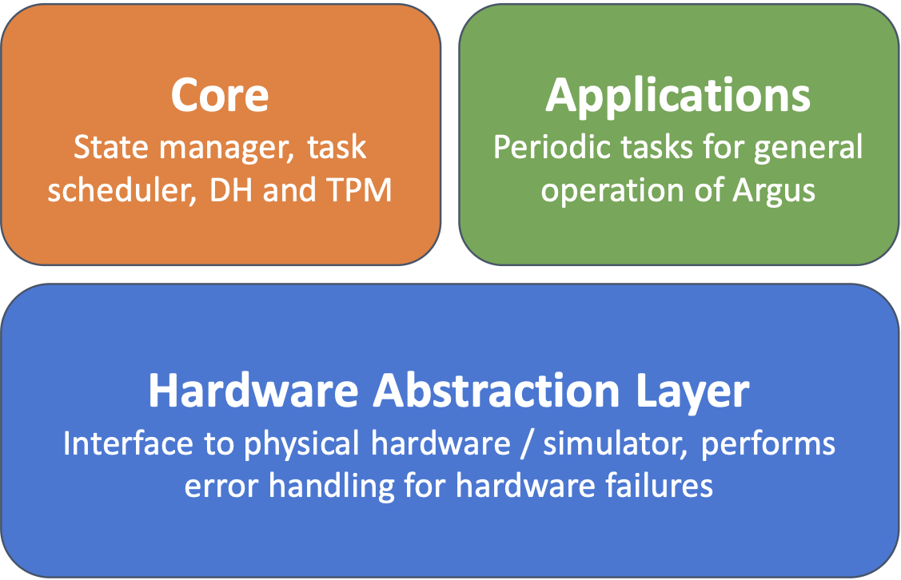

# Architecture

The onboard flight software for Argus follows a hierarchical architecture, structured into distinct layers that isolate hardware interfacing, fault handling, core functionalities, and mission-specific applications.

## Hardware Abstraction Layer (HAL)
The HAL interfaces directly with the spacecraft’s hardware, managing initialization, communication, and status reporting for all hardware components across the spacecraft bus (excluding payload elements). This layer ensures consistent, low-level access to the hardware, abstracting specific details to provide a standardized interface for higher software layers.

## Core Framework
The core framework layer is responsible for essential system services such as data handling (telemetry, onboard mass storage), task scheduling, state management, and command processing. This layer forms the backbone of the flight software, managing the flow of data and commands within the system.

## Application Layer
The application layer contains mission-specific software, including attitude determination and control, communication protocols, and payload control systems. This layer focuses on the execution of mission objectives and includes high-level functionality required for autonomous operations.

    

